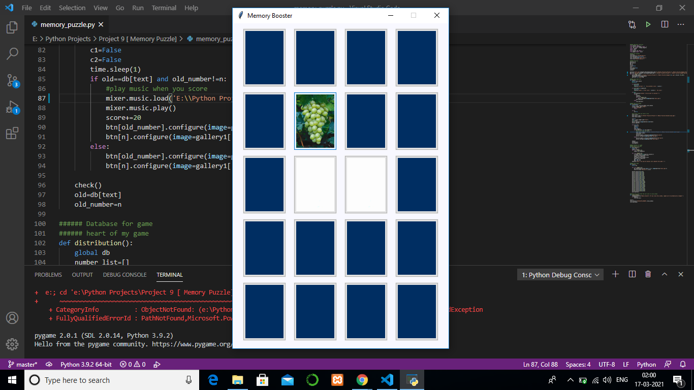
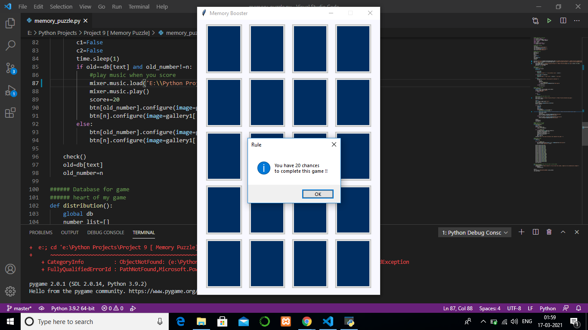

# Memory-Puzzle
## Idea
Memory puzzle is a great game to enhance your concentration power and improve your memory.  
At the starting of the game, the shapes are displayed for a second and then they are covered.  
One by one user selects the tile to uncover and when two similar shapes are uncovered the score  
gets increased.  This way we have to uncover all the pairs of shapes.

## overview 1

## overview 2

## Dependencies
You need to install following modules :
<ul>
  <li> Pillow : pip install Pillow</li>
  <li> Pygame : pip install pygame</li>
</ul>

## Description 
Download all files and put in a directory . Run the memory_puzzle.py file to start the game . 
You have 20 chances to complete this game . This app not stored any data, so if 
you close the game window the game start from the begining .

***** PLAY & LEARN & ENJOY *****

